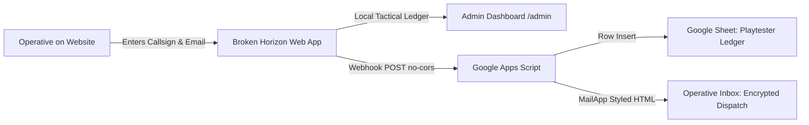

# Broken Horizon — Closed Playtest Google Sheets & Free Email Dispatch Guide

This setup is **100% free forever** on Google's free tier. It connects your website's Playtest clearance form directly to a private Google Sheet and sends styled encrypted dispatch emails from Ishaan Mirza without requiring any credit card or paid server.

---

## Architecture Overview



---

## Step 1: Create Your Free Google Sheet

1. Go to **[sheets.new](https://sheets.new)** in your web browser.
2. Title the sheet: `Broken Horizon Playtesters`.
3. In row 1, set up the following 4 column headers:
   - **A1**: `Timestamp`
   - **B1**: `Callsign`
   - **C1**: `Email`
   - **D1**: `ClearanceID`

---

## Step 2: Add the Apps Script Webhook

1. In your sheet's top navigation bar, click:
   **Extensions** &rarr; **Apps Script**
2. Replace all placeholder code in `Code.gs` with the code from [`Documentation/GOOGLE_APPS_SCRIPT_WEBHOOK.js`](file:///e:/GameDev/Broken_Horizon_Interactive_Site/Documentation/GOOGLE_APPS_SCRIPT_WEBHOOK.js).
3. Save the script (`Ctrl + S` or click the floppy disk icon).

---

## Step 3: Deploy as a Web App

1. Click the blue **Deploy** button (top right) &rarr; **New deployment**.
2. Click the **Gear icon** next to *Select type* &rarr; select **Web app**.
3. Configure the settings:
   - **Description**: `Broken Horizon Playtest Dispatcher`
   - **Execute as**: `Me (your_google_account@gmail.com)`
   - **Who has access**: `Anyone` *(Crucial so visitors on the website can register without Google authentication)*
4. Click **Deploy**.
5. Click **Authorize access**, choose your Google account:
   - Click **Advanced** &rarr; click **Go to Untitled project (unsafe)** &rarr; click **Allow**.
6. Copy the generated **Web app URL**:
   `https://script.google.com/macros/s/AKfycbx.../exec`

---

## Step 4: Connect to Your Website

You have two easy ways to plug in your URL:

### Method A (Instant via Website Admin Terminal — No Redeploy Needed)
1. Go to [https://broken-horizon.web.app/#/admin](https://broken-horizon.web.app/#/admin).
2. Enter your clearance passphrase (`BH-CLEARANCE-2026`).
3. Click the **GOOGLE SHEETS & WEBHOOK** button in the top navigation.
4. Paste your Web App URL into the field and click **SAVE**.
5. Click **TEST PING** — check your Google Sheet for the `TEST_OPERATIVE` test row!

### Method B (Environment Variable)
1. Create or edit `.env` in the project root:
   ```bash
   VITE_GOOGLE_APPS_SCRIPT_URL="https://script.google.com/macros/s/YOUR_SCRIPT_ID/exec"
   ```
2. Build and deploy:
   ```bash
   npm run build
   npx firebase-tools deploy --only hosting
   ```

---

## What the Player Receives

When any operative enters their callsign and email and clicks **REQUEST ACCESS**:
1. Their dossier is permanently logged in your Google Sheet with timestamp, callsign, and clearance ID.
2. Their application appears in your website's **Playtest Clearance Station** at `/#/admin`.
3. They receive an email in their inbox within 3 seconds:
   - **From**: `Broken Horizon // Pre-Alpha Dispatch`
   - **Subject**: `[PRE-ALPHA CLEARANCE] Dispatch Confirmed — Operative {CALLSIGN} ({CLEARANCE_ID})`
   - **Theme**: Dark AAA tactical terminal styling matching the game's aesthetic, quoting Ishaan Mirza.
