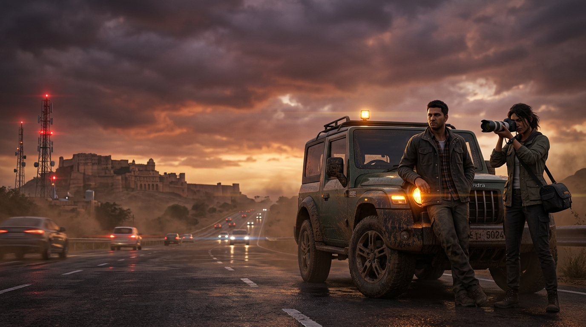
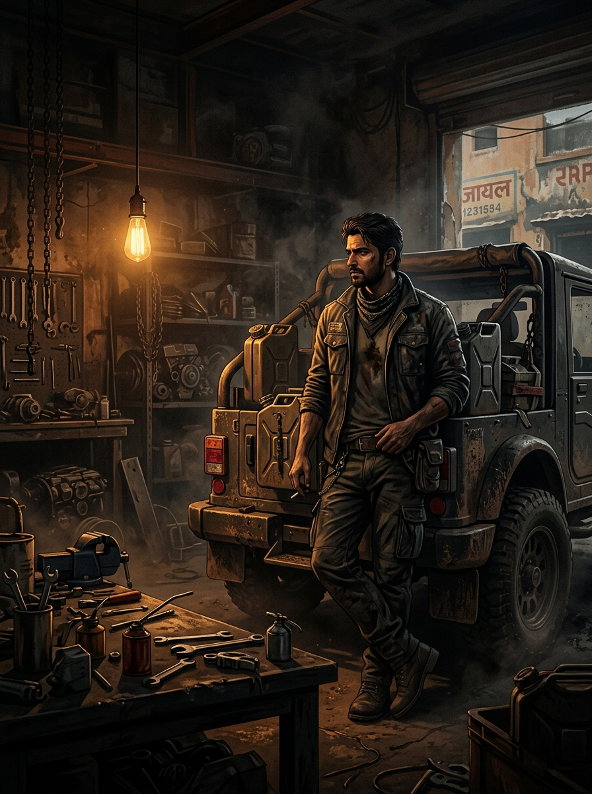
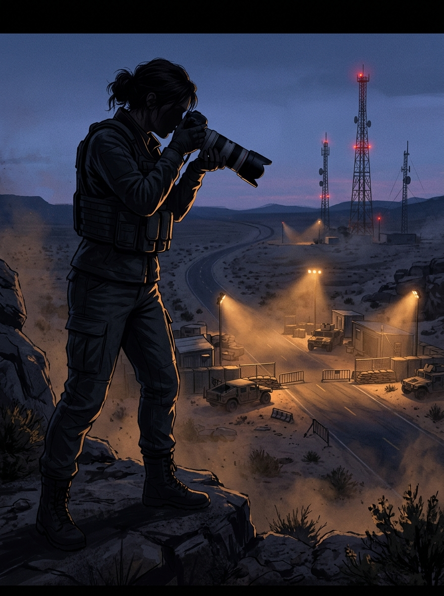
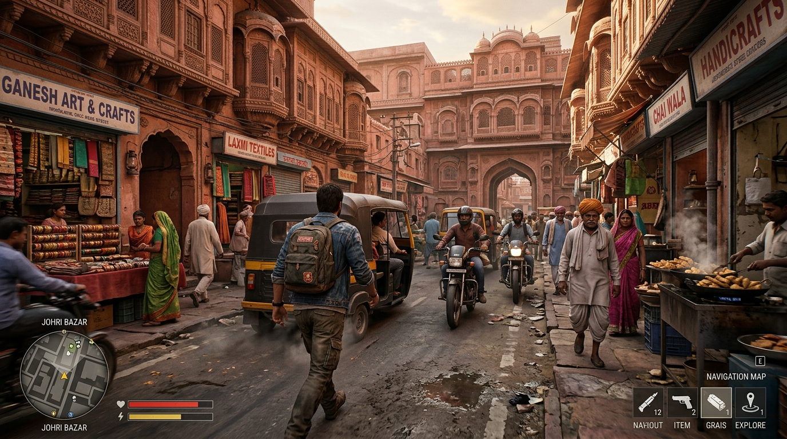
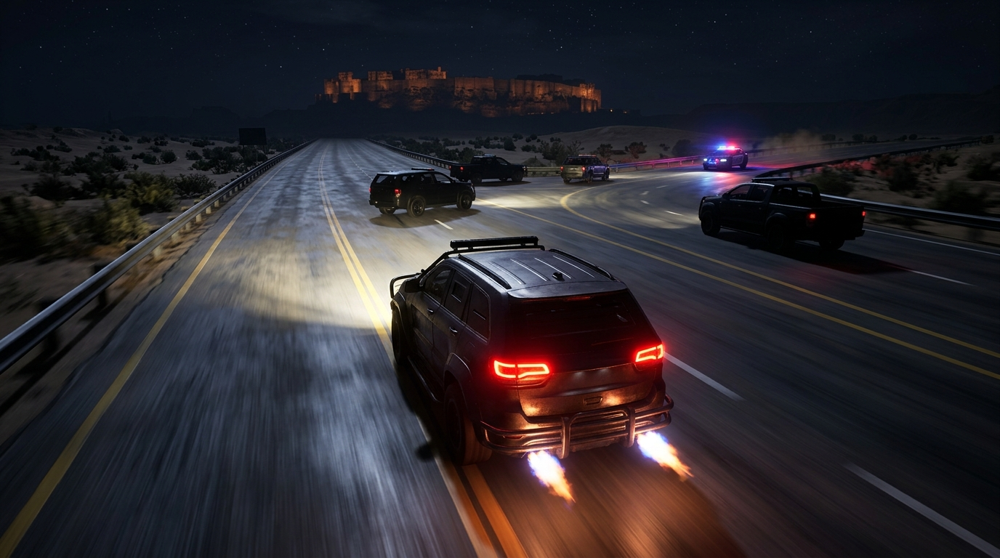
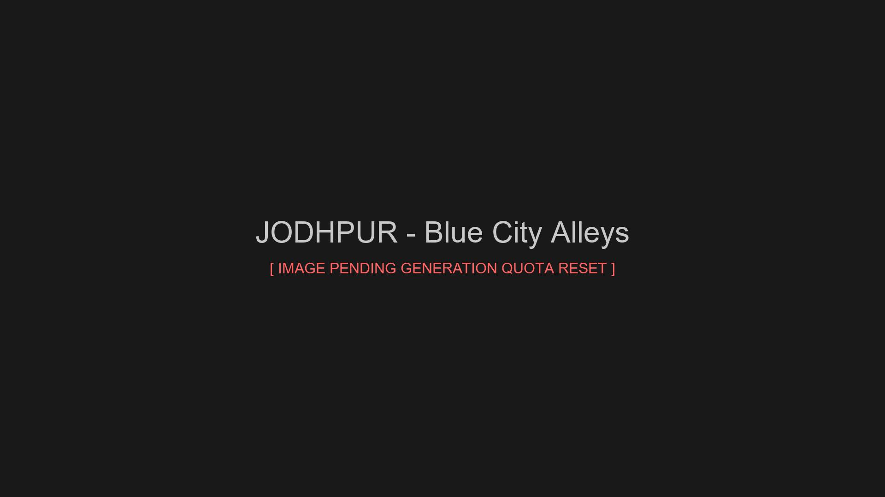

# BROKEN HORIZON — OFFICIAL WEB PORTAL & SHOWCASE

<div align="center">



**An Open-World Action-Adventure set across fictionalized Rajasthan, India.**  
*495 miles of contiguous highway corridors, desert dunes, and fortified frontiers. Built in Unreal Engine 4.27.*

[](https://broken-horizon.web.app)
[](https://samwooduis.itch.io/broken-horizon)
[](https://www.unrealengine.com/)
[](https://broken-horizon.web.app)

</div>

---

## 🏜️ ABOUT THE GAME

**Broken Horizon** is an authentic, investigation-driven AAA open-world action-adventure developed in **Unreal Engine 4.27 for Windows PC**. Set across the sun-scorched highways, sandstone citadels, industrial freight corridors, and desert wilderness of fictionalized Rajasthan, the game combines high-speed vehicular driving, stealth reconnaissance, deep environmental storytelling, and tactical investigation mechanics.

### 📖 The Story: The Horizon Conspiracy

The story begins beneath the sodium-vapor lights of **Mehta Garage** on the outer Jaipur Bypass. 

A multi-billion dollar private infrastructure mega-project known as the **Horizon Corridor** is aggressively carving its way across western Rajasthan. Marketed as a modern freight expressway, the corridor is systematically acquiring ancient lands, bulldozing historic settlements, sealing off subterranean water baoris, and operating clandestine convoy checkpoints under private security escort.

When an intercepted telemetry manifest reveals that the corridor is a front for illegal seismic excavation targeting an ancient subterranean anomaly beneath the Thar Desert, two unlikely allies cross paths:

* **Arjun Mehta**, an underground wheelman on the run after refusing an off-books transport delivery for the syndicate, and
* **Kavya Rathore**, an uncompromising investigative photojournalist gathering evidence of corporate collusion between political power-broker Mahesh Khandelwal and the elusive Vardhan Meridian conglomerate.

Armed only with a custom-fabricated expedition 4×4 rig, encrypted radio gear, and telephoto surveillance cameras, they embark on a perilous 495-mile trek westward from Jaipur across Sambhar Salt Flats, the Aravalli mountain switchbacks, Udaipur's hidden waterways, and the treacherous dunes of the Thar Sea toward the fortified bastions of Jaisalmer.

---

## 👥 THE OPERATIVES (CHARACTERS)

### 01. Arjun Mehta — *The Wheelman & Master Fabricator*
<div align="center">



</div>

* **Role:** Lead Protagonist / Driver / Mechanic
* **Age:** 29
* **Base of Operations:** Mehta Garage (Jaipur Bypass, Mile 00)
* **Vehicle:** Custom 4.0L Turbo Diesel 4×4 Expedition Rig
* **Background:** A gifted mechanic and former long-haul convoy driver who knows every unmapped backroad, dried riverbed, and subterranean bypass in Rajasthan. Pragmatic, resourceful, and fiercely protective of his family workshop, Arjun relies on vehicular mastery and mechanical fabrication to survive high-speed highway pursuits and evade private security patrols.

---

### 02. Kavya Rathore — *The Investigative Photojournalist*
<div align="center">



</div>

* **Role:** Co-Protagonist / Investigative Journalist / Forensics
* **Age:** 27
* **Specialty:** Signal Interception, Surveillance Photography, Telemetry Decryption
* **Equipment:** Professional Telephoto DSLR, Directional Microphone, Encrypted Field Terminal
* **Background:** An independent documentary reporter investigating environmental destruction and state corruption. Fearless and analytical, Kavya infiltrates restricted Horizon Corridor transit depots, photographs corporate collusion at remote checkpoints, and deciphers intercepted shipping logs to expose the syndicate's true objectives.

---

## 📸 IN-ENGINE GAMEPLAY ARCHIVE

The game world features authentic physical materials, dynamic weather systems, believable Indian traffic populations, and cinematic third-person camera angles:

<div align="center">

| Urban Exploration (Jaipur Johri Bazar) | High-Speed Desert Highway Pursuit (Jodhpur) |
|:---:|:---:|
|  |  |
| *Arjun navigating through crowded heritage market streets* | *High-speed night pursuit with nitro boost & patrol strobes* |

| Off-Road Dune Carving (Jaisalmer) | Historic Old City Infiltration (Jodhpur) |
|:---:|:---:|
|  |  |
| *Expedition 4×4 cresting massive sand dunes before a haboob* | *Investigative foot exploration through historic blue alleys* |

</div>

---

## 🗺️ CONNECTED WORLD & ROAD NETWORK

The game's open world is structured around a contiguous **495-mile travel corridor** connecting **13 distinct Rajasthan territories**:

1. **Jaipur** (`CURRENT GAMEPLAY / ACTIVE DEVELOPMENT`) — The Pink City, dense urban freight bypasses, Mehta Garage home base.
2. **Dausa** (`WORLD PREVIEW`) — Rural highway corridors and ancient stepwell complexes.
3. **Sawai Madhopur** (`WORLD PREVIEW`) — Rugged dry-forest perimeter roads and tactical checkpoints.
4. **Kota** (`WORLD PREVIEW`) — Chambal riverfront bridges and multi-lane concrete urban infrastructure.
5. **Bundi** (`WORLD PREVIEW`) — Serpentine hill roads, narrow step alleys, and historic fortress approaches.
6. **Ajmer** (`WORLD PREVIEW`) — Dargah market congestion and misty Aravalli mountain lakes.
7. **Pali** (`WORLD PREVIEW`) — Heavy industrial textile corridors and freight depots.
8. **Jodhpur** (`WORLD PREVIEW`) — The Blue City alleys and high-speed night highway pursuit straightaways.
9. **Jaisalmer** (`WORLD PREVIEW`) — Golden Thar Desert dunes and elevated sandstone citadels.
10. **Barmer** (`WORLD PREVIEW`) — Remote desert industrial energy pipelines and remote border checkpoints.
11. **Udaipur** (`WORLD PREVIEW`) — Moonlit heritage lake basins, water havelis, and subterranean baoris.
12. **Rajsamand** (`WORLD PREVIEW`) — Expansive reservoir roads and serpentine mountain switchbacks.
13. **Sikar** (`WORLD PREVIEW`) — Historic painted haveli streets and agricultural farmland routes.

---

## ⚡ WEB PORTAL ARCHITECTURE

The companion web application replicates a AAA game interface:
* **Illustrated 3D-Relief Tactical World Atlas:** Interactive topographical relief map of Rajasthan with custom pan/zoom, coordinate HUD, and 13 clickable district dossiers.
* **Connected World Network:** 6 milestone hero cards with responsive WebP variants, route pipeline vector schematic, and interactive full-screen modal lightbox.
* **Mehta Garage 2.5D Tuning Lab:** Real-time tire pressure, suspension geometry, and procedural Web Audio diesel engine acoustics dyno.
* **Dual Operative Telemetry:** Instant dossier switching between Arjun Mehta and Kavya Rathore with simulated audio intercepts.
* **32-Screenshot Visual Archive:** Comprehensive filterable archive with fullscreen lightbox, metadata pills, and responsive lazy loading.
* **Playtest Access Hub:** Automated playtest registration flow with secure admin dashboard.

---

## 🛠️ TECH STACK

* **Game Engine:** Unreal Engine 4.27 (Physically Based Rendering, Chaos Vehicle Physics)
* **Frontend Web Application:** React 19 + TypeScript
* **Bundler & Build Tool:** Vite
* **Styling:** Custom Vanilla CSS Design System (`rockstarEditorial.css`)
* **Audio Engine:** Web Audio API (Synthesized procedural vehicle acoustics)
* **Icons:** Lucide React
* **Hosting:** Firebase Hosting CDN

---

## 🚀 LOCAL SETUP

```bash
# 1. Clone the repository
git clone https://github.com/shreyansh316/broken-horizon-web.git

# 2. Enter project directory
cd broken-horizon-web

# 3. Install dependencies
npm install

# 4. Start local development server
npm run dev

# 5. Build for production
npm run build

# 6. Run automated test suites
python tests/BH_WorldNetworkImageAcceptanceTest.py
python tests/BH_VisualArchiveAcceptanceTest.py
python tests/BH_DistrictScreenshotDiversityAcceptanceTest.py
```

---

## ⚖️ INTELLECTUAL PROPERTY & CREDITS

* **Game Title:** Broken Horizon
* **Core Universe:** Broken Horizon © All Rights Reserved.
* Developed with **Unreal Engine 4.27**. Unreal® is a trademark or registered trademark of Epic Games, Inc.
* All fictional automobile, vehicle manufacturer, character, and corporate names (*Aravalli Motors*, *Rajputana Mobility*, *Bharat Roadworks*, *Horizon Automotive*, *Vardhan Meridian*) are purely fictional.
